# Lab7Web
# Nama      : Abby Muhammad Titan
# Nim       : 312110546
# Kelas     : TI.21.B.1
# UNIVERSITAS PELITA BANGSA
# Pertanyaan Dan Tugas
# Buatlah program PHP sederhana dengan menggunakan form input yang menampilkan nama, tanggal lahir dan pekerjaan. Kemudian tampilkan outputnya dengan menghitung umur berdasarkan inputan tanggal lahir. Dan pilihan pekerjaan dengan gaji yang berbeda-beda sesuai pilihan pekerjaan.

# Jawaban TUGAS Program PHP Sederhana
# input nama, tanggal lahir dan pekerjaan 
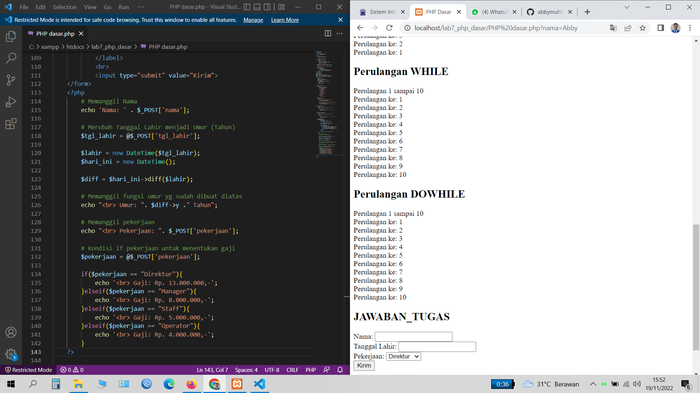
# Dan ini hasil output Program sederhana
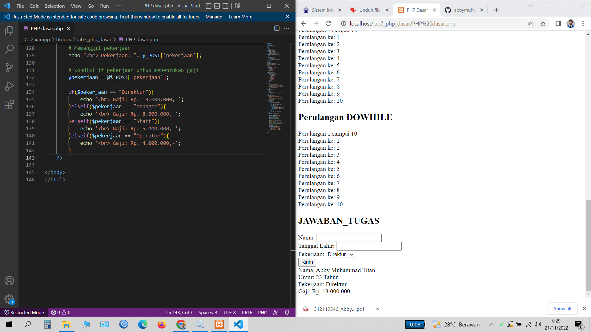

# Langkah 1
# Proses 1
# Menjalankan Web Server
# Untuk menjalankan web server dari menu XAMPP Control.
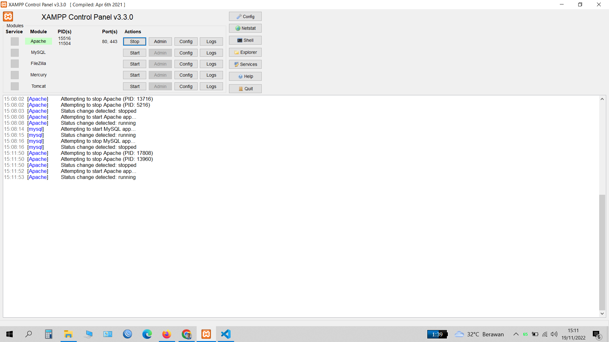
# Langkah 2
# Proses 2
# Memulai PHP
# Buat folder lab7_php_dasar pada root directory web server(d:\xampp\htdocs), Kemudian untuk mengakses direktory tersebut pada web server dengan mengakses URL: http://localhost/lab7_php_dasar/
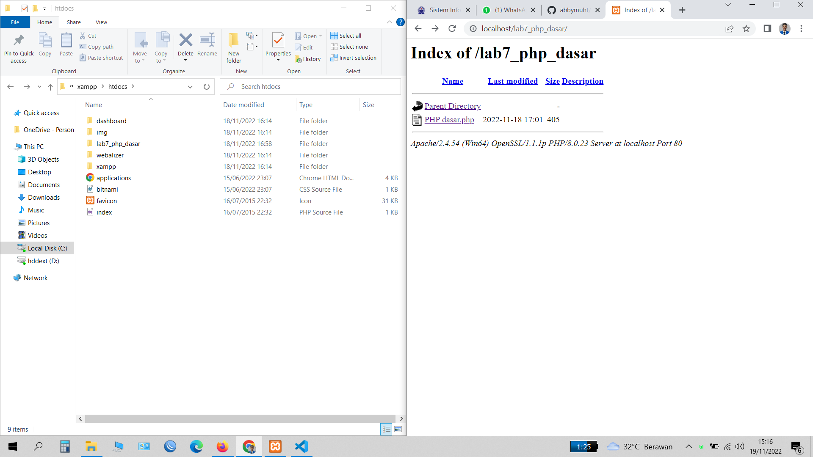
# Langkah 3
# Proses 3
# PHP Dasar
# Buat file baru dengan nama php_dasar.php pada directory tersebut. Kemudian buat kode Hello World seperti tampilan berikut.
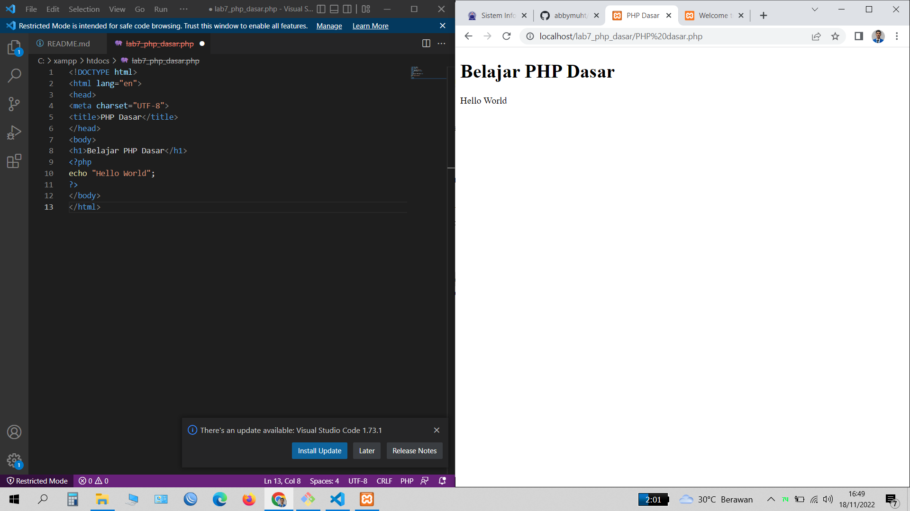
# Langkah 4
# Proses 4
# Variable PHP
# Menambahkan variable pada program.
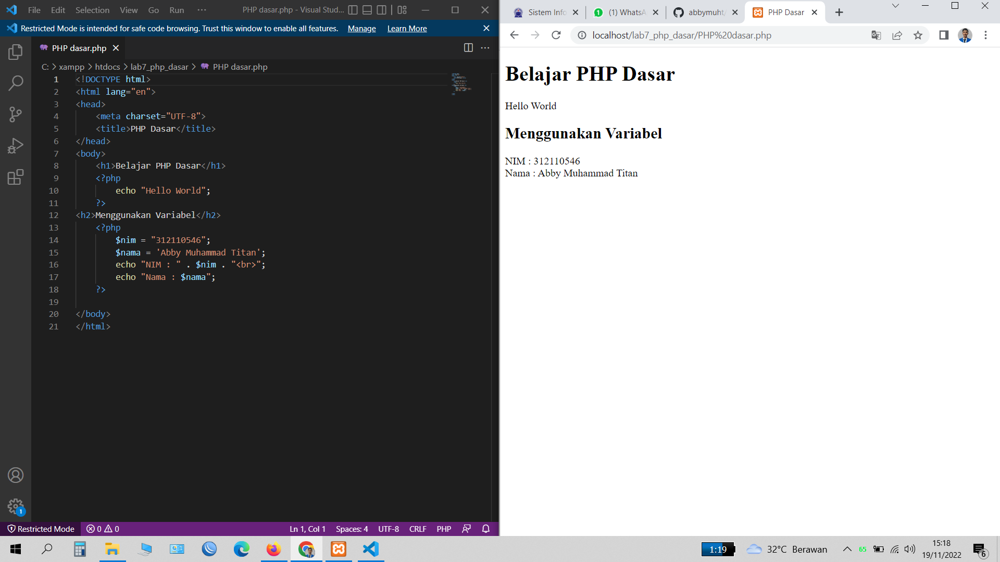
# Langkah 5
# Proses 5
# Predefine Variable $_GET, Untuk mengaksesnya gunakan URL: http://localhost/lab7_php_dasar/latihan2.php?nama=AbbyMuhammadTitan
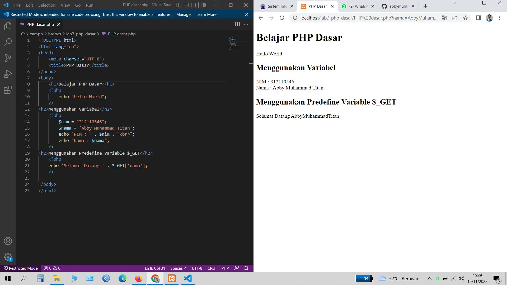
# Langkah 6
# Proses 6
# Membuat Form Input
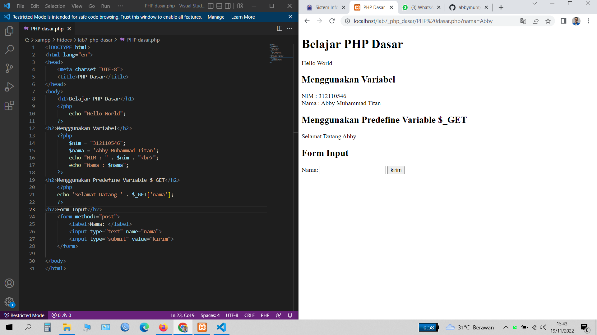
# Langkah 7
# Proses 7
# KOndisi Operator
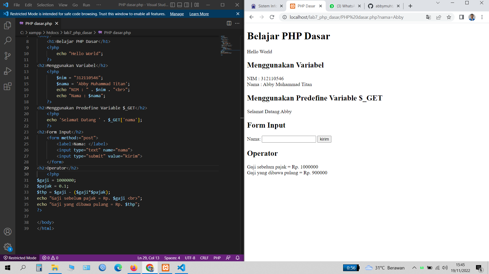
# Langkah 8
# Proses 8
# Kondisi IF
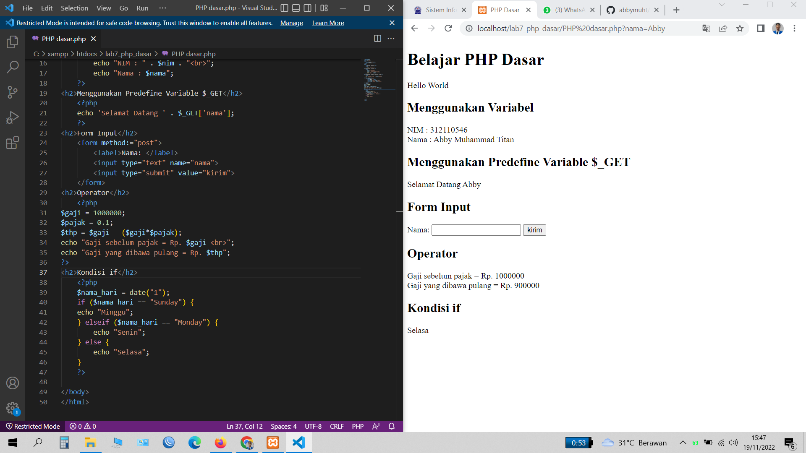
# Langkah 9
# Proses 9
# Kondisi Switch
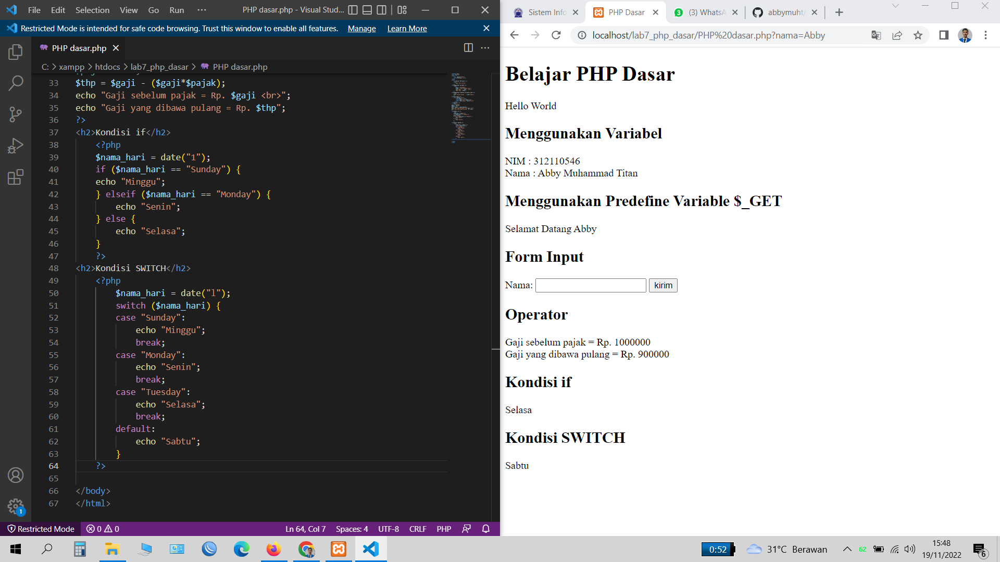
# Langkah 10
# Proses 10
# Perulangan for
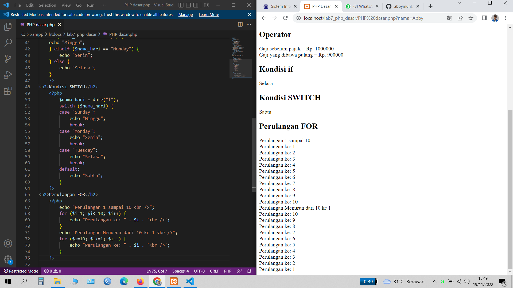
# Langkah 11
# Proses 11
# Perulangan while
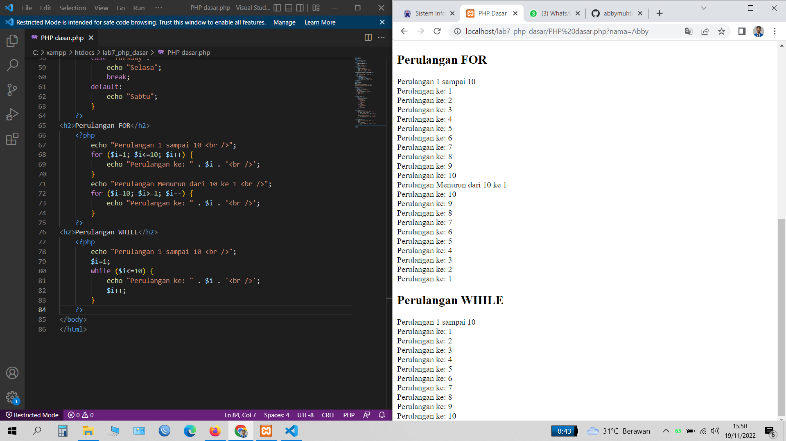
# Langkah 12
# Proses 12
# Perulangan dowhile
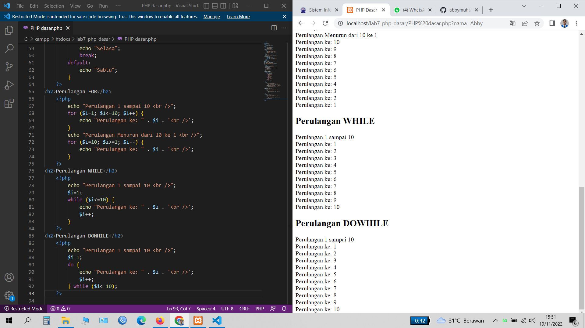
# Cukup sekian saya Abby Muhammad Titan
# Terimakasih, Semoga Bermanfaat.
# Assalamualaikum